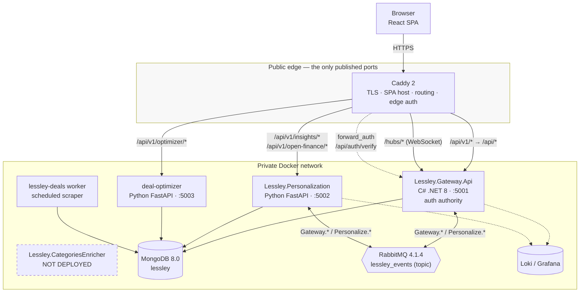
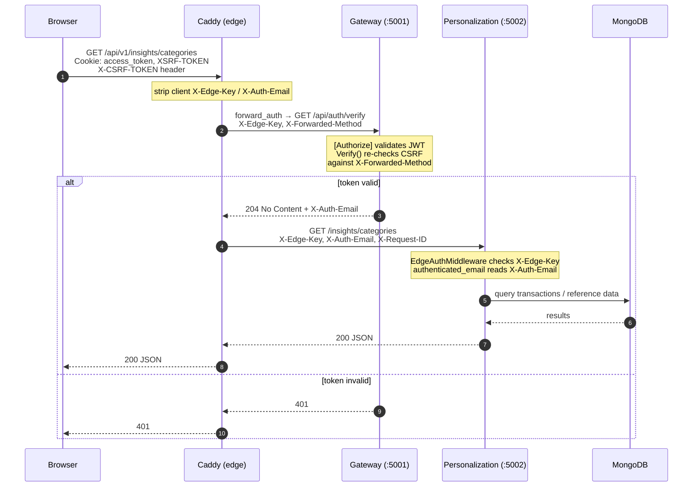
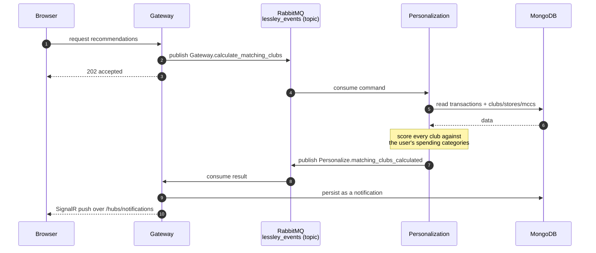
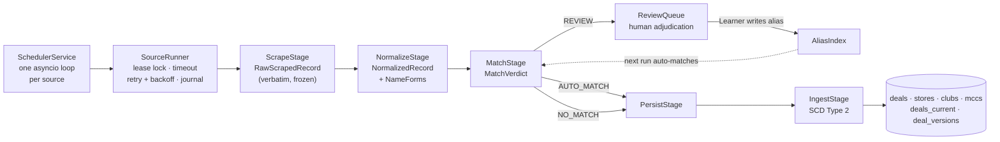
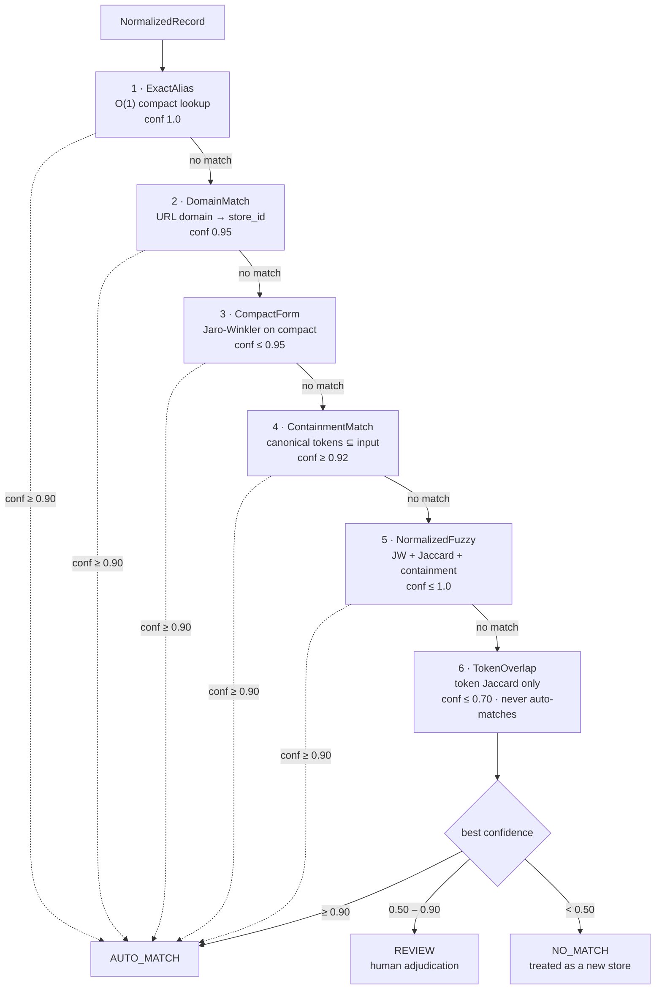
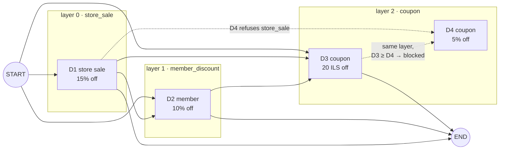
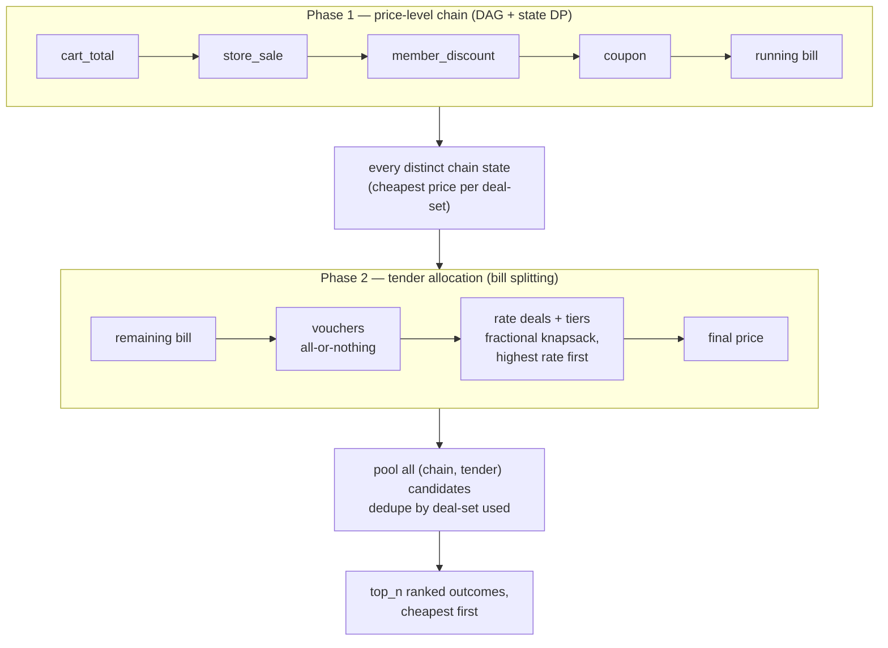
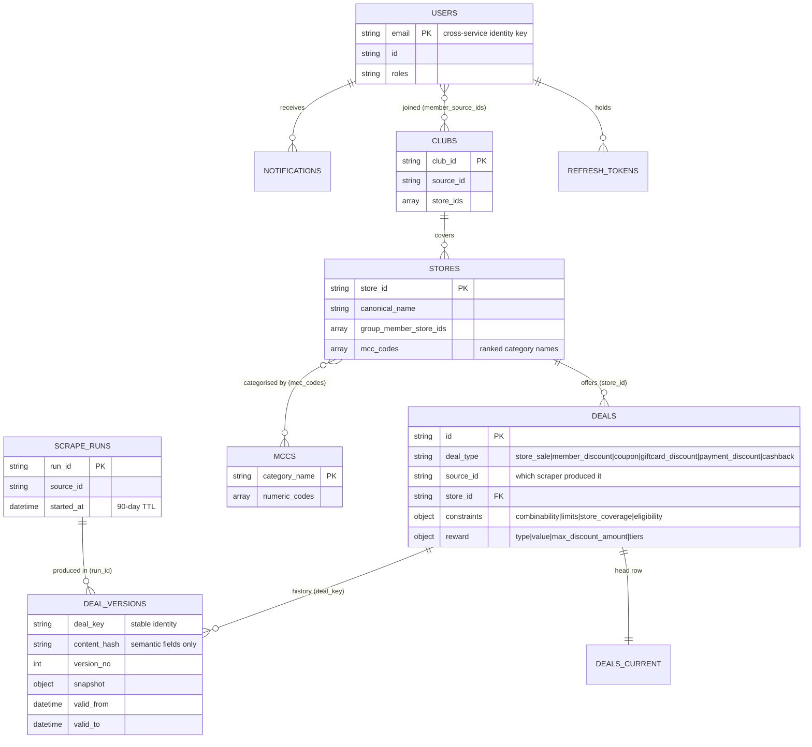

# 3. System Design and Implementation

## 3.1 System Architecture

### 3.1.1 Design principles

Five principles shape the architecture. They are stated first because every subsequent
decision in this chapter follows from one of them, and because they were fixed in writing
before the code was written.

**One public entry point.** A single edge component terminates TLS, serves the client
application and routes every API call. Nothing else is reachable from outside. The client
never addresses a service directly.

**Identity is established once, at the edge.** The edge authenticates each request and injects
a verified identity inward. No service derives identity from anything the caller supplied.
This is the direct application of the Access Token pattern [3], and the failure it prevents is
Broken Object Level Authorization [1]: a service that accepted an `email` parameter would let
any authenticated caller read any other user's financial data.

**Authentication is separated from proxying.** This is where Lessley departs from the
canonical API Gateway pattern [2]. In Richardson's formulation the gateway both authenticates
and proxies, so every service sits behind it and adding a service means adding proxy code.
Here the edge authenticates *every* request but proxies only what it owns: it routes each API
prefix directly to the service that owns it, having first verified the caller against a
separate authentication authority. Adding a client-facing service costs one edge route and two
header checks, and requires no change to the authentication authority at all.

**No service-to-service HTTP.** Services never call each other synchronously. Work that
crosses a service boundary goes over a message bus. This removes an entire class of failure
(cascading timeouts, retry storms, circular dependency) and makes each service's inbound
surface exactly one thing: the edge.

**One shape for shared data.** The catalogue collections are written once by the scraping
pipeline and read directly by every consumer. There are no projected copies to keep in step.

### 3.1.2 Service inventory

| Service | Language / runtime | Container port | Role | Deployed |
|---|---|---|---|---|
| Caddy (edge) | Caddy 2 | 80 / 443 | TLS, SPA host, routing, edge authentication | Yes |
| `Lessley.Gateway.Api` | C# / .NET 8 | 5001 | Authentication authority; users, clubs, deal search, MCC data, notifications, SignalR | Yes |
| `Lessley.Personalization` | Python 3.11 / FastAPI | 5002 | Open Finance access, spending insights, recommendations | Yes |
| `deal-optimizer` | Python 3.12 / FastAPI | 5003 | Deal-stacking engine (library, CLI and HTTP) | Yes |
| `lessley-deals` | Python 3.12 | — | Scraping, normalization, matching, enrichment, versioning worker | Yes, from its own Compose file |
| `Lessley.CategoriesEnricher` | Python / FastAPI | — | LLM-backed transaction, store and deal classification | **No** |
| `lessley-frontend` | React 18 / TypeScript / Vite | 8000 (dev) | Mobile-first SPA; built bundle is baked into the edge image | Yes, as static assets |

Supporting infrastructure: MongoDB 8.0, RabbitMQ 4.1.4, Grafana Loki and Grafana, plus
mongo-express in development only.

`Lessley.CategoriesEnricher` is implemented in full and has its own Dockerfile, but it appears
in neither `lessley-cd/docker-compose.yaml` nor `lessley-cd/docker-compose.prod.yaml` and has
no route in `lessley-cd/Caddyfile`. It is therefore not part of the request path in any run
mode. It is described in §3.3.4 as what it is — completed but undeployed work — and bringing
it into the deployment is discussed in chapter 5.

The `deals-pipeline` and `deals-worker` entries in `lessley-cd/docker-compose.yaml:215-247`
are commented out; the scraper worker is deployed from
`lessley-deals/docker-compose.worker.yml` instead.

### 3.1.3 The edge and the request path



*Figure 1: Lessley system architecture. Dashed border indicates an implemented but
undeployed service.*

The edge configuration is a single Caddyfile shared by development and production; only
environment values differ between them (`lessley-cd/Caddyfile:1-18`). Three of its behaviours
carry the architecture.

First, **inbound trust headers are stripped before any routing decision**
(`lessley-cd/Caddyfile:43-44`):

```caddy
request_header -X-Edge-Key
request_header -X-Auth-Email
```

Because this happens before the `handle` blocks match, a client cannot forge either header.
Every value of these two headers seen by a service was set by the edge.

Second, **each service-owned prefix is authenticated and routed in one block**. The
Personalization block is representative (`lessley-cd/Caddyfile:50-63`):

```caddy
@personalization path /api/v1/insights/* /api/v1/open-finance/*
handle @personalization {
    forward_auth gateway:5001 {
        uri /api/auth/verify
        copy_headers X-Auth-Email
        header_up X-Edge-Key {$EDGE_API_KEY}
    }
    uri strip_prefix /api/v1
    reverse_proxy personalization:5002 {
        header_up X-Edge-Key {$EDGE_API_KEY}
        header_up X-Request-ID {http.request.uuid}
    }
}
```

The `forward_auth` directive sends a sub-request to the Gateway's verify endpoint; if it
succeeds, Caddy copies the `X-Auth-Email` header from that response onto the original request
and forwards it. These blocks must precede the general `/api/v1/*` handler, since `handle`
blocks match top-down — an ordering constraint with a security consequence, documented in the
file itself.

Third, **the Gateway block is deliberately not `forward_auth`'d**
(`lessley-cd/Caddyfile:92-98`): the Gateway authenticates its own requests, being the authority
that issued the token in the first place. Its prefix is rewritten from `/api/v1/` back to
`/api/` so that existing controller routes are unchanged.

### 3.1.4 The authenticated request path



*Figure 2: One authenticated request to an edge-routed service.*

Two details in this path are worth drawing out.

**The CSRF check survives the sub-request.** The Gateway applies double-submit CSRF protection
in middleware, but only on unsafe methods and only when the request carries the access-token
cookie (`Middleware/CsrfProtectionMiddleware.cs:29-48`). The `forward_auth` sub-request is
always a `GET`, so that middleware would skip it — meaning a `POST` proxied through the edge
would have its CSRF check silently bypassed. `AuthController.Verify()` closes this by
re-applying the same rule against the *original* method, which Caddy forwards as
`X-Forwarded-Method` (`Controllers/AuthController.cs:203-222`):

```csharp
var originalMethod = Request.Headers["X-Forwarded-Method"].ToString();
if (!string.IsNullOrEmpty(originalMethod) &&
    !CsrfProtectionMiddleware.IsSafeMethod(originalMethod) &&
    !string.IsNullOrEmpty(Request.Cookies[AuthCookieNames.Access]))
{
    // …compare X-CSRF-TOKEN header against XSRF-TOKEN cookie in fixed time
}
```

The comparison uses `CryptographicOperations.FixedTimeEquals`, so it does not leak token
content through timing. The predicate `IsSafeMethod` is deliberately shared between the
middleware and the controller so the two cannot drift apart.

**Verification is exempt from rate limiting.** `Verify()` runs once per proxied request, so
the controller's own 5-per-minute auth policy would break the application immediately; it
carries `[DisableRateLimiting]`, with the originating request already rate-limited at the edge
(`Controllers/AuthController.cs:195-197`).

Each service then enforces the edge contract independently. The Gateway rejects any request
without a matching `X-Edge-Key` (`Middleware/EdgeVerificationMiddleware.cs:53-62`), and
Personalization and deal-optimizer do the same in
`middleware/edge_auth_middleware.py:44-55` and `deal_optimizer/edge_auth.py`. All three
describe this in their own comments as *defence in depth* rather than the primary control —
the primary control being that production publishes no port for these services. It exists so
that a stray `ports:` entry or a network-policy regression cannot silently expose an
unauthenticated service.

The local-debug bypass is gated on **two** independent conditions in every service, so neither
a stray flag nor a mis-set environment can open production alone
(`Middleware/EdgeVerificationMiddleware.cs:35-42`, `middleware/edge_auth_middleware.py:16-26`):

```python
def dev_bypass_active() -> bool:
    return settings.Environment.lower() == "development" and settings.Edge_AllowUnverified
```

Each logs a loud warning at startup while active.

### 3.1.5 Asynchronous work: RabbitMQ and SignalR

Recommendation work — computing missed savings, or scoring every club against a user's
spending — is too slow to sit inside a request. It travels over a shared topic exchange
instead.



*Figure 3: The asynchronous recommendation path.*

The exchange is `lessley_events`, declared as a durable topic exchange by both sides
(`services/publishers/rabbit_base.py:10`, `services/rabbitmq_publisher.py:17`). Routing keys
are directional by convention: `Gateway.*` for commands travelling to Personalization,
`Personalize.*` for results travelling back. The Gateway configures publish topology and
receive endpoints through MassTransit 8.2.5
(`ServiceCollectionExtensions.cs:261-345`), binding each queue to the shared exchange with an
explicit routing key:

```csharp
cfg.ReceiveEndpoint("gateway.matching_clubs_calculated", e =>
{
    e.Bind("lessley_events", b =>
    {
        b.ExchangeType = "topic";
        b.RoutingKey   = "Personalize.matching_clubs_calculated";
    });
});
```

Personalization publishes with raw `aio_pika` rather than MassTransit, so the two sides agree
on wire format rather than on a shared library. The Python publisher declares the exchange
idempotently and retries on a broken connection, discarding its cached exchange handle so the
next attempt re-declares (`services/publishers/rabbit_base.py:41-68`).

Delivery to the browser is by SignalR. The hub is mapped at `/hubs/notifications`
(`Program.cs:164`), and connections are addressed by email claim through a custom
`IUserIdProvider` (`Hubs/EmailUserIdProvider.cs:8-9`). The `/hubs` path is exempt from CSRF
middleware because SignalR's negotiate is a `POST` that rides the auth cookie but cannot carry
a custom header, while hub invocations themselves travel over the WebSocket and are not
CSRF-able (`Middleware/CsrfProtectionMiddleware.cs:29-33`).

### 3.1.6 The shared data layer

Gateway, Personalization and deal-optimizer share one MongoDB database and read the same four
collections the scraping pipeline writes: `deals`, `stores`, `clubs` and `mccs`. There is no
projected copy in between. Personalization and deal-optimizer read `users` read-only; every
write goes through the Gateway or over RabbitMQ.

The pipeline's own change history lives in `deals_current` and `deal_versions`, which are
deliberately *not* the read path. They carry each deal under a `snapshot` sub-document and
cover only the sources of whichever run last populated them. Reading them from a consumer is
recorded in the repository as the cause of a real defect — every HOT deal was invisible to the
optimizer until the read path was corrected to the shared `deals` collection.

## 3.2 Data Collection and Preprocessing

The `lessley-deals` service builds the catalogue that everything else consumes. It is a
five-stage pipeline driven by a scheduler that runs each source independently and
concurrently.



*Figure 4: The scraping pipeline. The dotted edge is the learning feedback loop.*

### 3.2.1 Collection

Each retail source is an adapter extending `BaseSourceAdapter` and registered in
`scraping/registry.py`. Ten code-based adapters are registered by default
(`scraping/registry.py:203-214`): HOT, Mastercard, Behatsdaa, Isracard TopCash, Swish, two
Hever datasets (`hever_gift_card_company`, `hever_teamim_card_store`) and three PaisPlus
datasets. Sources use one of three fetch strategies depending on how defended the site is —
`httpx` for most, `curl-cffi` where a JS challenge must be bypassed, and a full browser where
the page renders client-side.

For sites with no clean API, a generic LLM scraper avoids writing an adapter at all: an entry
in `data/seed/llm_sources.json` giving a `site_id`, a `url` and free-text `instructions` is
enough, and the adapter renders the page, cleans the DOM, chunks it and extracts deals through
the LLM client into the same record types a hand-written adapter produces. A file-based
variant reads a locally saved page instead of fetching, for sources behind a login the scraper
cannot automate.

The repository is explicit that this route is a fallback, not a default: a hand-coded adapter
is preferred wherever the source is already structured. The Hever adapters illustrate the
point — they fetch public JSON datasets and map every field directly, with no model call and
no inference. The LLM route is reserved for cases where fields must be *found* in messy prose
rather than read from named fields.

**Raw records are preserved verbatim and frozen.** Whatever the source published is stored
unmodified, which makes any downstream result traceable and any run replayable without
re-fetching.

### 3.2.2 Normalization

`NormalizationPipeline` (`normalization/pipeline.py:17-42`) applies an ordered list of steps to
each raw record and emits an immutable `NormalizedRecord`. The six steps
(`normalization/steps/`) are text cleanup, Hebrew normalization, store-name extraction, price
parsing, deal-text cleaning and date parsing.

The Hebrew step is the one that earns its place. As §2.1.4 established, niqqud is rarely
present in ordinary modern Hebrew text [9], so the same store name may appear with and without
diacritics across two sources. The step strips niqqud, unifies final-form letters, resolves
Unicode presentation forms, removes legal suffixes and separates branch descriptors from chain
names.

Each normalized record carries three name forms
(`normalization/pipeline.py:45-50`): the `normalized` form (Hebrew-normalized,
whitespace-collapsed, lower-cased), a `compact` form with all whitespace and punctuation
removed and final forms unified, and a token set. The three exist because different matching
stages need different views of the same name.

### 3.2.3 Store resolution

`MatchPipeline` (`matching/pipeline.py:34-90`) runs six stages in a fixed order, short-circuiting
on the first confident answer:



*Figure 5: The six-stage store-resolution pipeline and its three-way verdict.*

The thresholds are `auto_match_threshold = 0.90` and `review_threshold = 0.50`
(`matching/config.py:8-9`). The three-way verdict — auto-match, review, no-match — is the
Fellegi–Sunter decision structure described in §2.1.3 [6], and Jaro–Winkler [7] is the
comparator behind stages 3 and 5.

Two design choices deserve comment.

**Token-only stages never auto-match.** `TokenOverlap` is capped at 0.70 and is excluded from
the short-circuit by name (`matching/pipeline.py:20`, `:53-57`). Token-set overlap alone is too
weak a signal to accept unsupervised — it would happily match two unrelated chains that share
a common word — so it can only ever contribute a review candidate.

**The review queue is an input, not just an output.** Confirmed human decisions are written
back into the alias table by the `Learner`, so the same comparison resolves at stage 1 with
confidence 1.0 on the next run. The system's matching accuracy therefore improves with use, and
review effort is spent once per distinct name variant rather than once per run.

### 3.2.4 Constraint enrichment

`ConstraintsStage` turns each deal's `terms_and_conditions` prose into the structured
`constraints` block, using a local LLM through `enrichment/constaints_parser.py`. This is the
schema-constrained extraction task surveyed in §2.1.5 [10].

The system prompt is **assembled per source**: a shared base carrying the schema, the rules and
generic Hebrew vocabulary, plus an optional source-specific terminology block, with the
output-discipline reminder kept last. Every site words the same restriction differently and
leans on a different instrument — a voucher, a loadable card, a club card — so each scraped
source has its own block grounded in that source's real terms text.

The recurring failure the prompts are written against is **a number that looks like a limit but
is not**. A shekel ceiling per transaction, a wallet-loading tier, a per-member voucher cap, a
calendar day of the month and a cashback waiting period all present as a number with a unit,
and none of them is a usage limit. Only a count scoped to a single purchase fills
`max_uses_per_transaction`. Unit tests assert that these specific mappings survive edits to the
prompts.

Two engineering properties of this stage matter more than its accuracy.

**Identical terms cost one model call.** Sources reuse boilerplate heavily. `ConstraintsStage`
groups deals by the exact `(source_id, terms)` pair and parses each group once. Because the
parser is deterministic — temperature 0, fixed seed — and its prompt depends on nothing else,
the fan-out is byte-identical to parsing every deal separately. It is a saving with no accuracy
cost.

**A model that cannot be reached is not fatal.** The provider defaults to the faculty's
self-hosted model, reached over an internal address with a self-signed certificate and a
Run:AI host header (`enrichment/llm_client.py:25-37`). A parse that cannot reach a model is
logged and skipped. The consequence is that a misconfigured deployment scrapes perfectly well
and silently leaves `constraints` empty — availability bought at the price of a silent
correctness gap. This is discussed further in §4.5.

### 3.2.5 Versioning and guarded expiry

Deal history follows the SCD Type 2 pattern described in §2.1.7 [13]. Data is never
overwritten: every change appends an immutable `DealVersion`, and a `CurrentDeal` head row
holds the latest state.

Two distinct hashes carry the model (`versioning/hashing.py:163`, `:182`). `deal_key` is
stable identity and must survive edits; `content_hash` covers semantic fields only and must
ignore timestamps and URL tracking parameters. A reworded deal is therefore recognised as the
same deal changed, not as one deal expired and another created.

`plan_ingestion` (`versioning/ingestion.py:149`) is a **pure function** — it takes the current
heads and the run's records and returns a plan classifying each deal as new, updated,
unchanged, expired or reactivated. The service around it only loads, plans and bulk-writes.
Purity here is a testability decision: the whole classification is unit-testable without a
database.

The adaptation the warehousing literature does not cover is expiry. A warehouse load is
authoritative; a scrape may be partial. Absence is therefore **not** treated as deletion. A
deal is expired only when three conditions hold together
(`versioning/ingestion.py:26-32`, `:72-85`):

1. the run completed without errors;
2. it covered at least `min_coverage_ratio` (default 0.5) of the deals currently held for that
   source; and
3. the deal has been missing for at least `absence_threshold` (default 2) consecutive runs
   **and** at least `absence_grace` (default 24 hours) of wall-clock time.

The asymmetry is deliberate and is documented as such: under-expiring is recoverable, mass
false expiry is not.

### 3.2.6 Scheduling

The worker runs one `asyncio` loop per source, each wrapped by a `SourceRunner` that
(`scheduling/runner.py:5-10`):

1. takes a cross-process lease lock, skipping the run if another replica holds it;
2. opens a run-journal entry;
3. executes the job under a hard timeout;
4. retries with exponential backoff and jitter on failure, up to `max_attempts`;
5. releases the lease — always, including on cancellation.

The lease TTL is computed as the whole retry budget multiplied by a safety factor
(`scheduling/runner.py:74-79`), because a lease that expired mid-retry would let a second
worker start the same source concurrently. Schedules come from a seed file and are overridable
per source by environment variable; cron parsing is implemented in-repository rather than
taking a dependency.

## 3.3 Implementation Details

### 3.3.1 Gateway (C# / .NET 8)

The Gateway is the authentication authority and the owner of user-facing state. It follows a
layered Controller → Service → Repository structure: controllers validate and delegate,
services hold business logic, repositories own persistence.

The middleware order in `Program.cs:107-161` encodes the security model:

```csharp
app.UseForwardedHeaders();                            // before anything reads scheme or IP
app.UseMiddleware<SecurityHeadersMiddleware>();
// … exception handler, request logging …
app.UseRouting();
app.UseCors("DefaultCorsPolicy");
app.UseMiddleware<EdgeVerificationMiddleware>();      // reject non-edge traffic first
app.UseAuthentication();
app.UseMiddleware<CsrfProtectionMiddleware>();
app.UseMiddleware<LogContextMiddleware>();
app.UseRateLimiter();
app.UseAuthorization();
```

Edge verification runs *before* authentication, so a request that did not come through the edge
is rejected before any cryptographic work is spent on it. Forwarded-header handling runs first
because the app sits behind a TLS-terminating proxy and must see the original scheme and client
IP; known-proxy lists are cleared because the Gateway is reachable only via Caddy on the
private network (`Program.cs:25-36`).

The absence of one thing is architecturally load-bearing and is recorded in the code
(`Program.cs:57-58`):

```csharp
// No HttpClient to Personalization: the Gateway never calls it over HTTP. Client traffic
// reaches Personalization through Caddy; server-to-server work goes over RabbitMQ.
```

Persistence uses EF Core with the MongoDB provider (`MongoDB.EntityFrameworkCore` 8.4.0) over
ASP.NET Core Identity. That provider has real limits, and the code works within them rather
than around them: `UserManager.GetRolesAsync` emits a join the provider cannot translate, so
roles are resolved with a two-step query-then-`Contains` pattern used consistently across
`AuthController`, `JwtService` and `AdminController` (`Controllers/AuthController.cs:233-245`).
This is the kind of constraint that only surfaces at implementation time and is worth recording
as a genuine trade-off of choosing an ORM over the native driver for this workload.

Structured logging is Serilog into Grafana Loki, with username and request id enriched onto
every request log (`Program.cs:138-148`).

### 3.3.2 Personalization (Python 3.11 / FastAPI)

Personalization performs **no user-level authorization of its own**. It acts on whatever
identity it is handed, which is what makes the two rules in §3.1.1 load-bearing rather than
stylistic: identity comes from `X-Auth-Email` via `dependencies/auth.py:49`, and no route
accepts an `email` parameter.

Services are registered in a singleton DI container (`services/di_container.py`) and every
service method is `async def`. Documents are Beanie ODM models. The application's lifespan hook
loads reference data, initialises the publisher and — only when `RabbitMQ_Enabled` — starts the
consumer task, tearing all three down in order on shutdown (`main.py:180-200`). Making the
consumer conditional is what allows the service to start with no broker present, which is the
documented remedy for a class of local-development hang.

The exception handlers (`main.py:234-353`) map failure classes onto honest status codes, and
one distinction is worth noting: an upstream API refusing a request produces `502 Bad Gateway`
rather than `500`, on the stated reasoning that an upstream refusal "is a bad gateway, not an
internal fault of ours" (`main.py:312-335`). Every handler echoes the request id, so a user-
visible error can be traced to a log line.

Open Finance access is through a dedicated client (`services/clients/open_finance_client.py`)
that caches per-user access tokens, refreshes them 300 seconds ahead of expiry to survive clock
skew and latency, and serialises concurrent refreshes behind an `asyncio.Lock` so a burst of
requests produces one token request rather than many.

Club recommendation is scored rather than filtered: `RecommendationService.score_clubs` counts
how many of each club's stores sell something the user actually buys, and `_describe_fit` turns
a raw score into the verdict shown to the user, accounting for clubs already joined
(`services/recommendation_service.py:67-163`).

### 3.3.3 deal-optimizer (Python 3.12)

The optimizer is the technical core, and it is deliberately a **library first**: `engine.py`
knows nothing about HTTP, the FastAPI surface lives behind a `service` extra, and the module
depends only on `pydantic`, importing nothing from `lessley_deals`.

**Schema and adapter.** `schema.py` defines the lean target shape — a top-level `deal_type`
plus a `constraints` block covering combinability, limits, store coverage and eligibility.
`adapter.py` also accepts the legacy enrichment shape and translates it, so the engine runs on
existing data rather than requiring a migration first.

**Eligibility pruning.** Before any search runs, `deal_eligibility` (`engine.py:86`) removes
deals the user cannot use: required membership, required payment method, preferred store type
and monthly usage caps. Both membership and payment-method checks key on `source_id` — which
scraper a deal came from — rather than on `club_id`, because `source_id` is required on every
real deal while `club_id` needs a separate registry lookup and is frequently unset. A deal with
no `source_id` cannot be verified and is kept optimistically.

**Phase 1 — the price-level chain.** Store sales, member discounts and coupons chain through a
DAG under the fixed layer order `store_sale → member_discount → coupon`
(`graph.py:21-28`). An edge `A → B` exists only when both sides agree and B's layer is not
earlier than A's (`graph.py:138-152`).



*Figure 6: Phase-1 DAG for a worked example. Dotted edges are rejected — one by bilateral
combinability, one by the same-layer ordering rule that keeps the graph acyclic.*

Because validity depends on **every** deal already in the chain and not merely on the previous
one, the DP state is `(current_vertex_id, frozenset(applied))` (`engine.py:3-4`). The inner
loop re-validates each candidate against every prior member (`engine.py:236`):

```python
if any(not mutually_compatible(by_id[u_id], v, unknown_as_yes) for u_id in applied):
    stats["path_conflict"] += 1
    continue
```

This is what stops a three-deal stack containing a pairwise-illegal member that is not adjacent
in the chain — the concrete correctness requirement identified in §1.2.

**Phase 2 — tender allocation.** Gift-card loads, card-brand payment discounts and cashback
are not price reductions. Each discounts only the slice of money routed through that
instrument, and the same money cannot be routed twice, so chaining them double-counts
(`tender.py:1-42`). `tender.py` solves them as bill-splitting instead: fixed-value vouchers are
all-or-nothing lumps, percentage-off deals are continuous up to their cap, and the optimal
split across rate deals is the fractional-knapsack greedy — fill the highest-rate segment
first [12].

The greedy runs over **segments**, not whole deals, and the reasoning is recorded in the module
docstring: picking whole options by headline rate would strand money on a tiered card's low rung
while a better flat deal went unused. The example given is exact — a 30%/500 plus 10%/500 card
against a flat 20% card on 1500 ILS yields 350, not 300.



*Figure 7: The two-phase optimization. Phase 2 runs once per phase-1 state and is the final
phase — its result is the final price.*

**Bounding the search.** `max_deals` (default 3) caps the combination length across *both*
phases and is enforced during the search, not by filtering afterwards
(`engine.py:45-49`, `:226-228`, `:387`). A chain state that has spent the budget is simply never
extended, while shorter states remain available to phase 2. A cap of 2 therefore returns the
best possible pair rather than a truncated five-deal stack, and a lower cap is also a cheaper
search because it prunes the state space. The justification is executability, recorded in the
code: the engine "will happily stack seven coupons for another few shekels, but nobody juggles
seven coupons at a checkout".

**Output.** `optimize()` returns the top `top_n` (default 5) distinct ranked outcomes, pooled
across every (chain state, tender allocation) pair and deduplicated by the actual set of deals
used, since many candidates collapse to the same real-world outcome (`engine.py:305-308`).
The trivial "apply nothing" path is dropped: START → END is a real path but not an option worth
offering, so callers render "no stack found" from an empty list.

Per-step output deliberately separates two kinds of field so they cannot be confused:
whole-cart running state (`bill_before` / `bill_after`) versus this-step-only state
(`ils_covered`, `discount_rate`, `savings`). A card capped at 1000 ILS on a 1200 ILS cart still
reports `bill_before: 1200` — the whole cart at that point — with `ils_covered: 1000` saying
what the card itself covered.

One behaviour is easy to get backwards and is worth stating plainly: **an absent wallet is
optimistic, not restrictive.** Omitting `member_source_ids` means "unknown user" and prunes
nothing; sending a wallet that lacks a deal's required `source_id` is what prunes it.

### 3.3.4 Lessley.CategoriesEnricher — implemented, not deployed

The service exposes four routes — `POST /categories/enrich`, `POST /categories/store-mcc`,
`POST /categories/deal-category` and `GET /categories/health` — following the same
routers/services/clients layering as Personalization, with LLM-backed classification in
`services/clients/llm_integration.py`.

It is not deployed. It has a Dockerfile but no Compose entry and no edge route, so nothing
starts it in any run mode and no request path reaches it.

Two inconsistencies in its documentation are recorded here rather than reproduced as fact.
Its README instructs the reader to run it on port 8002, which is the port `RUNNING.md` assigns
to Personalization; the two cannot both use 8002 in local-debug mode. And its README lists
`OpenAI_ApiKey` as required, while `config/settings.py:14` declares it `str | None = None` —
optional — and the rest of the platform routes LLM calls to a self-hosted model by default.

### 3.3.5 Frontend (React 18 / TypeScript / Vite)

The SPA is organised feature-first: one folder per feature under `src/features/` — `auth`,
`insights`, `deal-finder`, `optimizer`, `recommendations`, `notifications`, `hot-deals`,
`clubs`, `settings`, `admin`, `user`, `shell` — each with its own `api.ts` and hooks. Shared
primitives are shadcn/ui components under `src/components/ui/`, composed rather than patched.
State is Zustand for auth, TanStack React Query for server state, React Router 7 for routing,
Tailwind for styling, `recharts` for charts, `i18next` with Hebrew and English locales, and
`@microsoft/signalr` for the notification stream.

Every API call is **relative** (`/api/v1/…`), because the SPA is always served from the same
origin as the API — by Caddy in production, by the Vite proxy in development. There is no
gateway URL to configure and no CORS. `src/lib/api-client.ts` adds the CSRF header on
state-changing methods, sends cookies with `credentials: "include"`, and on a 401 attempts
exactly one cookie-based refresh before retrying; if the refresh fails it logs the user out
rather than retrying indefinitely:

```ts
if (response.status === 401 && !skipAuth) {
  const refreshed = await refreshAccessToken()
  if (refreshed) {
    response = await doFetch()
  } else {
    useAuthStore.getState().logout()
    throw new ApiError("Session expired. Please sign in again.", 401)
  }
}
```

Routing is guarded by three route components — `ProtectedRoute`, `GuestRoute` and `AdminRoute`
(`src/routes/`) — so an unauthenticated user cannot mount an authenticated page even before the
API refuses them.

> **[SCREENSHOT]** — Page/Screen: Insights page (`/insights`)
> Shows: spending-by-category breakdown, top accounts and top stores for the logged-in user
> How to reach it: run Mode 1 per `lessley-cd/RUNNING.md`, log in at `http://localhost:8000`, open "Insights" from the main navigation

> **[SCREENSHOT]** — Page/Screen: Optimizer page (`/optimizer`)
> Shows: cart entry (store, total, quantity) and the returned ranked deal stacks with per-step savings breakdown
> How to reach it: log in at `http://localhost:8000`, open "Optimizer", select a store and enter a cart total

> **[SCREENSHOT]** — Page/Screen: Recommendations page (`/recommendations`)
> Shows: matching-club recommendations with fit verdicts, and missed-savings results
> How to reach it: log in at `http://localhost:8000`, open "Recommendations" and trigger a recommendation run

> **[SCREENSHOT]** — Page/Screen: Deal Finder page (`/deal-finder`)
> Shows: deal search across the shared catalogue with store and category filters
> How to reach it: log in at `http://localhost:8000`, open "Deal Finder"

> **[SCREENSHOT]** — Page/Screen: Notifications page (`/notifications`)
> Shows: the notification list, with a live SignalR-pushed notification arriving
> How to reach it: log in at `http://localhost:8000`, open "Notifications"; trigger a recommendation to produce a push

> **[SCREENSHOT]** — Page/Screen: Admin page (`/admin`)
> Shows: user administration and role management, visible only to an admin account
> How to reach it: create the first admin via the bootstrap endpoint (`RUNNING.md`, First-time config step 8), log in as that user, open "Admin"

### 3.3.6 Data model



*Figure 8: MongoDB collections and their relationships. `deals`, `stores`, `clubs` and `mccs`
are the shared read path; `deals_current` and `deal_versions` are the pipeline's own change
history.*

A store's `mcc_codes` is a ranked list of **category names** (`GROCERIES`, `RESTAURANT`,
`CLOTHES_&_ACCESSORIES`, …), never the four-digit numbers. The closed set of 46 names and the
numeric-to-category mapping live in `enrichment/mcc_catalog.py`, and everything that writes the
field runs through `normalize_mcc_codes()` so that legacy numeric rows and loose spellings
resolve to the canonical name.

Store matching for deals covers `store_id`, `group_member_store_ids` and
`group_member_stores`, so a group-wide gift card surfaces for any member store — the mechanism
behind HOT's group-level cards, which are redeemable across a chain rather than at one branch.

### 3.3.7 Software and hardware specifications

**Software.**

| Component | Version |
|---|---|
| .NET | 8.0 (`net8.0`) |
| MassTransit / MassTransit.RabbitMQ | 8.2.5 |
| MongoDB.EntityFrameworkCore | 8.4.0 |
| Microsoft.AspNetCore.Authentication.JwtBearer / Identity.EntityFrameworkCore | 8.0.19 |
| Serilog.AspNetCore / Serilog.Sinks.Grafana.Loki | 10.0.0 / 8.3.2 |
| Swashbuckle.AspNetCore | 6.6.2 |
| Python (Personalization) | 3.11 (`python:3.11-slim`) |
| Python (deal-optimizer, lessley-deals) | ≥ 3.12 |
| React / React DOM | 18.3 |
| React Router | 7.18 |
| TanStack React Query | 5.101 |
| Zustand | 5.0 |
| `@microsoft/signalr` | 10.0 |
| i18next / react-i18next | 26.3 / 17.0 |
| MongoDB | 8.0 |
| RabbitMQ | 4.1.4 (management image) |
| Caddy | 2 (custom `lessley/edge` image carrying the built SPA) |
| Grafana Loki / Grafana | latest |

Python libraries in use include FastAPI, `httpx`, `aio_pika`, Motor and Beanie ODM, Pydantic
and `slowapi` on the service side, and `selectolax`, `curl-cffi`, Selenium, `typer` and `rich`
in the scraping pipeline. Tooling is `mypy` (strict), `ruff` (line length 120) and `pytest` for
Python; `tsc`, ESLint and Vitest for TypeScript; xUnit for .NET.

**Hardware.**

> **[MISSING]** The specification of the machine the system was developed and measured on
> (CPU, RAM, operating system), and of the deployment host if it differs. This is requested by
> the chapter specification and by §4.1, but it is not derivable from the repository. Tracked
> as **Q4** in `OPEN-QUESTIONS.md`.

What the repository does establish: the production deployment targets a single Docker Compose
host reachable at a college-administered DNS name, serving a pre-issued TLS certificate rather
than using ACME, with only Caddy publishing ports. The scraper worker defaults to three
sources scraped in parallel (`DEALS_MAX_CONCURRENCY`), which is the one tunable that maps
directly onto host capacity.

## 3.4 Evaluation Metrics

This section states what "correct" means for each subsystem and how it is measured. The
measurements themselves are reported in chapter 4.

**Store resolution — precision over recall, measured by verdict distribution.** The pipeline's
success criterion is not a single accuracy figure but the distribution of its three-way verdict
across a run: what proportion auto-matches at or above 0.90, what falls into the 0.50–0.90
review band, and what is discarded below 0.50. The design deliberately prefers a false negative
(a new store created unnecessarily) to a false positive (two distinct chains silently merged),
because the second corrupts every downstream recommendation and is hard to detect. A rising
review-band proportion is the signal that a source's naming has drifted; a falling one over
successive runs is the alias learner working.

**Optimizer — correctness by verification scenario, not by score.** The engine is
deterministic, so its evaluation is exactness rather than accuracy: for a given cart and deal
set, does it return the cheapest legal combination, and is every returned combination legal?
This is asserted by the scenario suite in `deal-optimizer/tests/test_verification.py`, with
dedicated suites for the parts most likely to be silently wrong — `test_tender.py` for
bill-splitting, `test_tiered_ladder.py` for stepped-rate cards, `test_max_deals.py` for the cap
being enforced during rather than after the search, `test_eligibility.py` for pruning, and
`test_per_step_breakdown.py` for the whole-cart versus this-step field distinction.

**Cross-service contracts — end-to-end tests against real infrastructure.** A message contract
or document shape spans C# and Python, so the meaningful test is one that crosses the boundary.
`Lessley.Gateway.Tests` covers this with `PipelineRealInfraE2ETests`, `AuthE2ETests`,
`NotificationE2ETests` and `UserE2ETests`, alongside unit tests for mapping and connection
management.

**Security properties — asserted, not documented.** The architectural rules in §3.1.1 are
executable claims. `SecurityE2ETests.cs` exercises the Gateway's edge and CSRF behaviour, and
`Lessley.Personalization/tests/test_edge_auth.py` and
`deal-optimizer/tests/test_edge_auth.py` assert that each service refuses traffic without a
valid edge key. The bypass being gated on two independent conditions is likewise a testable
property rather than a convention.

**Catalogue integrity — history preserved, expiry guarded.** The versioning criterion is that
no data is ever lost and no partial run can mass-expire the catalogue. `plan_ingestion` being a
pure function makes the whole new/updated/unchanged/expired/reactivated classification
unit-testable without a database, which is what allows the guard conditions to be verified
directly rather than inferred from a live run.

**Frontend — behaviour, not appearance.** Vitest covers auth-store logic and route guards
(`src/features/auth/store.test.ts`, `src/routes/ProtectedRoute.test.tsx`), with `tsc --noEmit`
and ESLint enforced as gates.

---

### Note on sourcing

Every implementation claim in this chapter is cited to a file and line in the repository.
Where the code carries a comment explaining *why* a decision was made, that reasoning is
attributed to the code rather than presented as the authors' recollection. Four external
citations appear — [1], [2], [3] in §3.1.1 and [9], [12], [13] in §3.2 — and all resolve to
chapter 6.

One naming inconsistency was noted while reading and is recorded rather than reproduced:
`Services/Classes/NotificationStore.cs` defines the class `NotificationRepository`, and
`Services/Interfaces/INotificationStore.cs` defines `INotificationRepository`. The type names
are used consistently throughout the code; only the two filenames disagree with them. This
chapter refers to the types.
